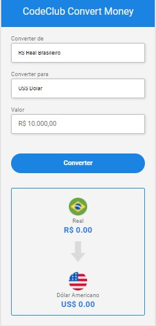

# Money Converter

Currency converter that convert BRL to USD, EU, and BTC

Use app: <a hredf="https://mauricio-bs.github.io/MoneyConverter">

 

## 📫 Contributing to Money Converter
<!---Se o seu README for longo ou se você tiver algum processo ou etapas específicas que deseja que os contribuidores sigam, considere a criação de um arquivo CONTRIBUTING.md separado--->
To contribute to MoneyConverter, follow these steps:

1. Fork this repository.
2. Create a branch: `git checkout -b <nome_branch>`.
3. Make your changes and conf9irm: `git commit -m '<commit_menssage>'`
4. Send to the original branch: `git push origin Blog-List / <local>`
5. Create a pull request.

## 🤝 Colaborators

<table>
  <tr>
    <td align="center">
      <a href="#">
         
        
          <b>Mauricio Schimit</b>
        
      </a>
    </td>
</table>

[⬆ Voltar ao topo](#Money Converter) 
